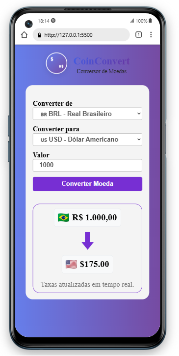

📦 Conversor de Moedas

## 💡 Sobre o Projeto

O **Conversor de Moedas** é uma aplicação web moderna que permite aos usuários converter valores entre diferentes moedas em tempo real. A aplicação utiliza a ExchangeRate API para buscar as taxas de câmbio mais atualizadas e apresenta os resultados de forma clara, rápida e intuitiva.

## 🛠 Tecnologias Utilizadas

- **HTML5** - Estrutura da aplicação
- **CSS3** - Estilização e responsividade
- **JavaScript** - Lógica de programação e integração com API
- **ExchangeRate API** - Fonte das taxas de câmbio em tempo real

## 🚀 Funcionalidades

✅ **Conversão entre múltiplas moedas** (BRL, USD, EUR, GBP, JPY, CAD, AUD, etc.)  
✅ **Interface intuitiva e moderna**  
✅ **Taxas de câmbio atualizadas em tempo real**  
✅ **Validação de entrada de valores**  
✅ **Design responsivo** (adaptado para dispositivos móveis)  
✅ **Bandeiras dos países** para identificação visual das moedas  
✅ **Suporte a mais de 30 moedas diferentes**  

## 📱 Demonstração

### 🖥️ Versão Desktop


### 📱 Versão Mobile


### 📔 Versão Tablet


## 🔧 Como Usar

1. **Selecione a moeda de origem** no primeiro dropdown
2. **Escolha a moeda de destino** no segundo dropdown
3. **Digite o valor** que deseja converter
4. **Clique no botão "Converter"**
5. **Visualize o resultado** da conversão instantaneamente

## 📁 Estrutura do Projeto

```
conversor-de-moedas/
├── assets/
│   └── images/
│       ├── celular.png
│       ├── computador.png
│       ├── real.png
│       ├── seta.png
│       └── Tablet.png
├── index.html          # Página principal
├── styles.css          # Estilos da aplicação
├── scripts.js          # Lógica JavaScript
└── README.md          # Documentação
```

## 🔮 Próximas Implementações

- [ ] **Histórico de conversões** - Salvar conversões anteriores
- [ ] **Modo escuro** - Alternância entre temas claro/escuro
- [ ] **Detecção automática de localização** - Seleção automática da moeda local
- [ ] **Gráficos de variação** - Visualização de tendências das moedas
- [ ] **Favoritos** - Salvar pares de moedas mais utilizados
- [ ] **Calculadora avançada** - Operações matemáticas com conversão

## 🧠 Autor

**Iann Pereira**

- 💼 LinkedIn: [Iann Matheus](https://linkedin.com/in/iann-pereira-dev)
- 🐱 GitHub: [@IannPereira28](https://github.com/IannPerreira28)
- 📧 Email: iannpereira20@outlook.com

---

⭐ **Gostou do projeto? Deixe uma estrela!**

Feito com 💙 e muito ☕ por [Iann Pereira](https://github.com/IannPereira28)